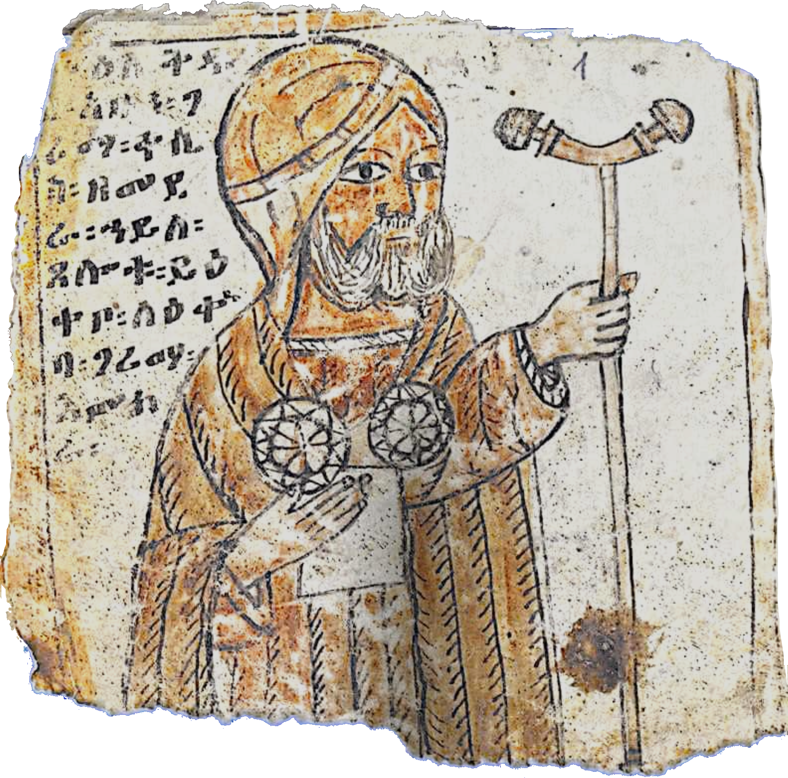
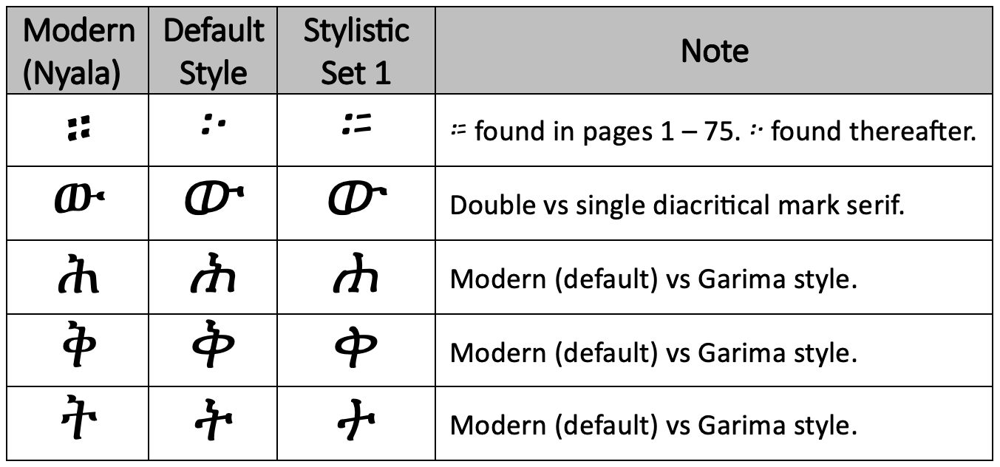
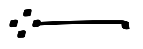
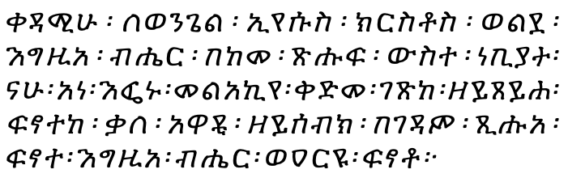

# The Abba Garima Typeface

## Summary
This is the source repository of the Garima font project. The Garima typeface has been designed in the style of the *oldest* known Geʾez manuscript, the Abba Garima Gospel 2, which dates from the 4th century AD. 

The Garima font is a free font distributed under the Open Font License ([OFL](https://scripts.sil.org/cms/scripts/page.php?site_id=nrsi&id=OFL)).  The initial release of the font has been developed by [Black Foundry](https://black-foundry.com/) and sponsored by the Geʾez Frontier Foundation. The Garima font provides all letters, numerals and punctuation used by the Geʾez language (260 symbols total). Contact Black Foundry to obtain a commercial version of the font that will cover modern languages (Amharic, Tigrinya, etc.).

## Introduction
 The Abba Garima Gospels are a collection of Geʾez language manuscripts in the care at the Ethiopian Orthodox monks of the Énda Abba Garima Monastary (እንዳ አባ ገሪማ). The Gospels have been at the monastary since at least the 6th century AD and are recognized as the oldest surviving Geʾez manuscripts as well as *the earliest* illuminated Christian gospels found *anywhere* in the world.

The earliest of the Abba Garima Gospels has been radio carbon dated to between 330 - 650 AD2, with 390 AD being a reasonable assumed year of its creation supported by other evidence. This first Gospel is believed to have been rendered by the hand of Saint Garima with support from the heavens. One of many miracles attributed to the saint was that he wrote and illuminated the gospel's 350 pages in a single day, a feat made possible when God stopped the sun and held in the sky so Saint Garima could endeavor to complete the task. 

The lettering style of Saint Garima is then the first and oldest example of Geʾez script (aka “Ethiopic”) calligraphy known to the world today as anything prepared earlier has since been lost to the passage of time. The saint is also our first known Geʾez scribe whose work we can still view and enjoy today. <!-- Abba Garima may have also been responsible for completing the syllabification of the Geʾez alphabet that was initiated by Abba Selamta. -->

With the Garima typeface we have tried to honor the divine work of Saint Garima and we have made our best effort to capture his original Geʾez style as he presented it for all the world to see. We hope that the font will be useful to researchers, educators, religious scholars, and enthusiasts alike who will use and so help us keep Saint Garima’s work alive for future generations.

In celebration of the release of the Garima font, a $1 USD donation will be made to the [Ethiopian Heritage Fund](http://www.ethiopianheritagefund.org/) for each download of the font.

1. Crawford, Matthew R., et al. The Garima Gospels: Early Illuminated Gospel Books from Ethiopia. United Kingdom, Manar al-Athar, University of Oxford, 2016.
2. Mark, W. (2007). Tsbook (Tigrinya for good) - the gospel of Abba Garima. Skin Deep. Retrieved August 24, 2022, from <https://www.hewit.com/skin_deep/?volume=23&article=1>.
3. HMML, Abbā Garimā Gospels 2, AG 00002, Retrieved August 24, 2022, from <https://w3id.org/vhmml/readingRoom/view/132897>.

## Letter Variants

 A number of symbols in the Garima Gospel show some shape change as the manuscript progresses. Where this occurs most significantly, the most frequently observed shape will be set as the default for the symbol. An alternative shape this is also found frequently, will be available in a [“Stylistic Set”](https://fonts.google.com/knowledge/glossary/stylistic_sets).  Word processors and standards like Cascading Style Sheets will use different approaches to accessing the alternative shape under the stylistic set. 

Most notably, the Ethiopic Fullstop, ።, begins as a 2-dot and 2-line mark before abruptly becoming a 3-dot symbol on the 75 written page (right page of image 0039 at vHHML). Since the predominately used shape for the majority of the Gospel is the 3-dot form, it was chosen as the default for fullstop and the alternative style is then available under the first stylistic set.

Three additional letter variants have been added where the Garima 6th order (*sadis*) style showed only a subtle distinction from the 1st order. To address these similarities the 6th order is made more distinct by applying the modern style of writing to the letters as their shapes. The Garima letter style is then made available under the first stylistic set. The following table shows the affected letter sets.

 
 
 
## Letter Additions

One special mark has been added to the font that is very frequently used in the Abba Garima Gospel. The mark is a mecheresha that accompanies the Ethiopic fullstop in the gospel manuscript, it can be seen in the follow image:

The mark is encoded in the Unicode Private Use Area at address U+F4C2 in keeping with the [EMUFI Project](http://emufi.geez.org/) assignment for the symbol.

## Samples

